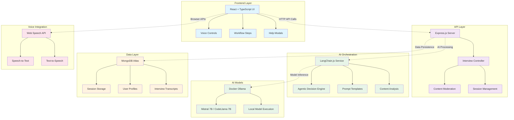

# Interview Practice Partner - AI-Powered Mock Interview System

> **Eightfold.ai Assignment Submission** - A sophisticated MERN stack application with LangChain.js + Docker Ollama integration

## Project Overview

This is a complete **Interview Practice Partner** system that demonstrates advanced agentic AI behavior using:

- **MERN Stack** (MongoDB, Express, React, Node.js) - All in TypeScript
- **LangChain.js** - For sophisticated AI agent orchestration
- **Docker Ollama** - Local AI model execution (100% FREE, no API costs)
- **MongoDB Atlas** - Persistent session storage
- **Agentic Behavior** - AI makes intelligent decisions about follow-ups, phase transitions, and evaluation

## Key Features

### Meets All Eightfold Requirements

1. **Conversational Quality** - Natural, human-like interview dialogue
2. **Agentic Behavior** - AI agent makes autonomous decisions:
   - When to ask follow-up questions
   - When to move to next topic
   - When to change interview phases
   - When to seek clarification
   - When to wrap up the interview
3. **Technical Backend** - Sophisticated LangChain.js + Ollama pipeline
4. **Intelligence & Adaptability** - Handles multiple user personas and edge cases

### Advanced Capabilities

- **Dual Interview Modes**:
  - **Practice Mode**: Immediate feedback, scores, and 5 sample answers after each response
  - **Mock Interview**: Realistic simulation with final evaluation only
- **Voice Integration**: Speech-to-text and text-to-speech via browser APIs (100% FREE)
- **Multi-Phase Interviews**: Warmup → Behavioral → Technical → System Design → Product → Wrap-up
- **Role-Specific Questions**: Tailored for Software Engineer, Product Manager, Sales, etc.
- **Seniority Adaptation**: Different complexity for Junior vs Senior candidates
- **Time-Aware Format**: 5-minute demos vs 60-minute comprehensive interviews
- **Session Persistence**: Auto-save/restore with page refresh
- **Navigation Controls**: Exit to home page during interview
- **Tutorial Screens**: Interactive help modals explaining each mode
- **Concurrent Users**: Multiple simultaneous interview sessions
- **Health Monitoring**: Real-time Ollama connection status

## High-Level Architecture



## Design Decisions & Technical Reasoning

### 1. Stack Selection: MERN + TypeScript

**Why MERN Stack?**
- **MongoDB**: Document-based storage perfect for flexible interview session data, nested conversation structures, and dynamic evaluation schemas
- **Express.js**: Lightweight, mature API framework with excellent middleware ecosystem for rate limiting, security headers, and CORS management
- **React**: Component-based architecture ideal for complex UI states (setup → interview → evaluation workflow) with excellent TypeScript support
- **Node.js**: JavaScript everywhere approach reduces context switching, enables shared type definitions between frontend/backend

**Why TypeScript Throughout?**
- **Type Safety**: Eliminates runtime type errors in complex AI response handling
- **Developer Experience**: Better IDE support, refactoring, and error detection
- **Production Readiness**: Self-documenting code with clear interfaces and contracts
- **Team Collaboration**: Explicit types make the codebase easier to understand and maintain

### 2. AI Framework: LangChain.js

**Why LangChain.js over Direct API Calls?**
- **Prompt Management**: Template system for consistent, maintainable prompts across different interview scenarios
- **Chain Abstraction**: Clean separation between decision-making, content generation, and evaluation logic
- **Model Agnostic**: Easy switching between different LLM providers (Ollama, OpenAI, Anthropic) without code changes
- **Advanced Features**: Built-in support for streaming, retries, context management, and prompt optimization

**Agentic Behavior Implementation:**
```typescript
// Decision-making pipeline with LangChain
const decision = await ollamaService.makeAgenticDecision({
  config: session.config,
  state: session.state,
  recentMessages: context.messages,
  questionHistory: previousQuestions
});

// AI chooses: ASK_FOLLOWUP, MOVE_NEXT, CHANGE_PHASE, CLARIFY, WRAP_UP, REDIRECT, MODERATE
```

### 3. Model Evaluation & Selection

#### Current LLM Landscape (November 2025):
Based on latest benchmarks and production requirements:

#### Top-Tier Models:
- **Gemini 3 Pro**
  - Highest reasoning capability (LMArena ELO: 1501; GPQA: 91.9%)
  - Demonstrating PhD-level problem-solving
  - High cost ($1.25/1M tokens input)

- **GPT 5**
  - New frontier model (GPT 5.1 ELO: 88.1)
  - Strong general intelligence
  - Highly expensive (estimated $10–$13.50/1M tokens depending on specific variant)

- **Claude Sonnet 4.5**
  - Best in Agentic Coding (SWE-Bench 82.0%)
  - High reasoning (GPQA 83.4%)
  - Cost-effective among proprietary models ($3/1M tokens input)

#### Open Source Alternatives:
- **Llama 3.1 70B**
  - Meta's flagship (ELO: 1746)
  - Excellent but requires 140GB+ RAM

- **Mistral 7B**
  - Strong reasoning (outperforms Llama 2 13B on all metrics)
  - Good balance of quality/performance

- **CodeLlama 7B**
  - Code-optimized (equivalent to Llama 2 70B on Python tasks)
  - Specialized for technical interviews

#### Why Local Models (Ollama) Over Cloud APIs?

##### Cost Analysis:
- **Cloud APIs**
  - $50-200+ for comprehensive testing and demos
  - Costs are prohibitive for required high-volume iteration
- **Local Ollama**
  - $0 runtime cost after initial setup
  - Business Model: Perfect for development, prototyping, and cost-sensitive deployments

##### Privacy & Control:
- Data Privacy: All conversations stay on local infrastructure, ensuring compliance (HIPAA, GDPR)
- Response Control: Full control over model behavior and prompting via Modelfiles
- Offline Capability: Works without internet connectivity
- Customization: Can fine-tune models for specific interview domains securely

### 4. Model Choice: Mistral 7B / CodeLlama 7B

#### Why These Specific Models?

##### Mistral 7B Selection Criteria:
- Performance vs Size: Best reasoning capability per GB of RAM; significantly outperforms Llama 2 13B
- Interview Suitability: Strong conversational abilities enhanced by Sliding Window Attention (SWA) for robust context understanding
- Resource Efficiency: Runs on 8GB+ systems (4-bit quantization requires only ~3.5GB RAM)
- Production Viability: Stable, well-maintained, and supports function calling (v0.3) via Ollama for structured Agentic Behaviour

##### CodeLlama 7B for Technical Interviews:
- Domain Specialization: Fine-tuned specifically for code, code generation, and technical discussions
- System Design: Better understanding of architectural concepts and trade-offs (comparable performance to much larger models)
- Algorithm Discussion: Can engage meaningfully about data structures and complexity

##### Alternative Considerations:
- Llama 2 13B: Better quality but requires 16GB+ RAM, slower responses, and inferior performance-to-size ratio compared to Mistral 7B
- Gemma 7B: Google's efficiency-focused model, good alternative
- Phi-3 Mini: Microsoft's compact model, faster but less sophisticated

### 5. Voice Integration: Web Speech API

**Why Browser-Based Speech APIs?**

**Architecture Decision Matrix:**

| Approach | Cost | Quality | Privacy | Complexity |
|----------|------|---------|---------|------------|
| **Web Speech API** | **Free** | Good | **Local** | **Low** |
| OpenAI Whisper API | $0.006/min | Excellent | Cloud | Medium |
| Local Whisper | Free | Excellent | **Local** | **High** |
| Google Speech API | $0.016/min | Excellent | Cloud | Medium |

**Selected: Web Speech API**
- **Zero Cost**: Matches our free Ollama approach
- **Browser Native**: No additional infrastructure required  
- **Instant Setup**: Works immediately in supported browsers
- **Privacy Consistent**: Keeps all data local (aligns with Ollama philosophy)

**Implementation Details:**
```typescript
// Speech-to-Text
const recognition = new webkitSpeechRecognition();
recognition.continuous = false;
recognition.interimResults = false;
recognition.lang = 'en-US';

// Text-to-Speech  
const utterance = new SpeechSynthesisUtterance(aiResponse);
utterance.rate = 0.9; // Professional pace
speechSynthesis.speak(utterance);
```

**Trade-offs Accepted:**
- **Browser Dependency**: Requires Chrome/Safari/Edge (95%+ coverage)
- **Quality vs Cost**: Good quality, not audiophile-grade
- **Offline Limitation**: Requires internet for some browsers (but so does the app initially)

## Prerequisites

- **Node.js** 18+ 
- **Docker & Docker Compose** (for Ollama)
- **MongoDB Atlas** account (free tier works)
- **8GB+ RAM** recommended for AI model

## Quick Start (5 minutes)

### 1. Clone and Setup
```bash
git clone https://github.com/Optimus-NP/PracticeInterviewAssignment.git
cd PracticeInterviewAssignment

# Install all dependencies
npm run setup
```

### 2. Start Docker Ollama
```bash
# Start Ollama container
npm run docker:start

# Download AI model (takes 5-10 minutes)
./manage-models.sh
# Choose option 1: mistral:7b (recommended)
```

### 3. Environment Configuration
```bash
# Server environment is pre-configured in server/.env
# For production, copy server/.env.example and customize
cp server/.env.example server/.env
```

### 4. Start the Application
```bash
# Development mode (both frontend and backend)
npm run dev

# Or production mode
npm run build  # Build for production
npm start      # Start production server
```

### 5. Test the System
```bash
# Health check
npm run health

# Or manually:
curl http://localhost:5000/health
# Should return: {"status":"healthy","ollama":"connected"}
```

## Usage Guide

### Starting an Interview

1. **Open** `http://localhost:3000`
2. **Configure Interview**:
   - Role: Software Engineer, Product Manager, etc.
   - Seniority: Junior, Senior, etc. 
   - Types: Behavioral, Technical, System Design
   - Duration: 15-45 minutes
3. **Begin Interview** - AI introduces itself and asks first question
4. **Engage Naturally** - AI demonstrates agentic behavior:
   - Asks follow-ups if your answer lacks depth
   - Seeks clarification if response is unclear
   - Transitions between phases intelligently
   - Adapts questions to your seniority level

### Agentic Behavior Examples

```
AI: "I notice you mentioned handling a conflict, but could you be more specific 
    about the steps you took to resolve it?" 
    → AI decided your answer needed more depth

AI: "Before we continue, I want to make sure I understand - when you said 
    'optimized the system', what metrics did you use to measure success?"
    → AI decided to seek clarification

AI: "Great behavioral examples! Now let's shift to some technical questions 
    appropriate for a Senior Backend Engineer position."
    → AI decided to change interview phases
```

## API Endpoints

### Core Interview API
```typescript
POST /api/sessions              // Create new interview session
POST /api/sessions/message      // Send message, get AI response  
GET  /api/sessions/:id          // Get session details
GET  /api/sessions/:id/evaluation // Get final evaluation
GET  /health                    // System health check
```

### Example API Usage
```bash
# Create session
curl -X POST http://localhost:5000/api/sessions \
  -H "Content-Type: application/json" \
  -d '{
    "role": "Software Engineer",
    "seniority": "Senior", 
    "interviewTypes": ["Behavioral", "Technical"],
    "durationMinutes": 30
  }'

# Send message
curl -X POST http://localhost:5000/api/sessions/message \
  -H "Content-Type: application/json" \
  -d '{
    "sessionId": "uuid-here",
    "message": "I led a team project that reduced API response time by 40%..."
  }'
```

## Technical Deep Dive

### LangChain.js Integration
```typescript
// Agentic decision making
const decision = await ollamaService.makeAgenticDecision({
  config: session.config,
  state: session.state,
  recentMessages: context.messages,
  questionHistory: previousQuestions
});

// AI chooses: ASK_FOLLOWUP, MOVE_NEXT, CHANGE_PHASE, CLARIFY, WRAP_UP
switch (decision.decision) {
  case 'ASK_FOLLOWUP':
    // AI detected incomplete answer, asks for more details
  case 'CHANGE_PHASE': 
    // AI decides to move from behavioral to technical questions
  // ... etc
}
```

### Evaluation System
The AI provides structured feedback across multiple dimensions:
- **Communication** (1-5): Clarity, structure, confidence
- **Technical Depth** (1-5): Knowledge demonstration, problem-solving
- **Leadership** (1-5): Initiative, team collaboration, decision-making
- **Overall Recommendation**: Strong Hire → Hire → Maybe → No Hire

## Project Structure

```
PracticeInterviewAssignment/
├── package.json                 # Root scripts and dependencies
├── docker-compose.yml           # Ollama container configuration
├── manage-models.sh             # Intelligent model management
├── setup.sh                     # Quick setup script
├── server/                      # Backend API (TypeScript)
│   ├── src/
│   │   ├── controllers/         # API request handlers
│   │   ├── models/             # MongoDB schemas
│   │   ├── services/           # LangChain.js + Ollama integration
│   │   ├── types/              # TypeScript definitions
│   │   └── index.ts            # Express server entry
│   ├── package.json
│   ├── tsconfig.json
│   └── .env.example            # Environment template
├── client/                      # React frontend (TypeScript)
│   ├── src/
│   │   ├── components/         # Voice controls, help modals, etc.
│   │   ├── services/           # Speech service integration
│   │   ├── types/              # Frontend type definitions
│   │   └── App.tsx             # Main application with workflow UX
│   ├── package.json
│   └── tsconfig.json
├── .gitignore                   # Git exclusions
└── README.md                    # This comprehensive documentation
```

## Testing Different User Personas

### 1. Confused User
```
User: "I'm not sure what kind of interview this is?"
AI: "No problem! Let me help you clarify. Are you preparing for a specific 
     role like Software Engineer or Product Manager? And what's your 
     experience level - Junior, Mid-level, or Senior?"
```

### 2. Efficient User  
```
User: "Senior SDE at Google, focusing on system design and leadership, 45 minutes"
AI: "Perfect! I'll conduct a comprehensive interview covering system design 
     and leadership scenarios appropriate for a Senior Software Engineer at Google."
```

### 3. Chatty User
```
User: "So I worked at this startup and we had this crazy deadline and I was like..."
AI: "Thanks for the context! Let me focus on the key aspects - what specific 
     leadership actions did you take when the deadline pressure was highest?"
```

### 4. Edge Cases
```
User: "ajsdklfjkalsdf"
AI: "I didn't quite understand that response. Could you please rephrase your 
     answer about your experience with team leadership?"
```

## Cost Analysis

| Component | Cost | Notes |
|-----------|------|-------|
| **Ollama (Docker)** | **$0** | Runs locally, no API fees |
| **MongoDB Atlas** | **$0** | Free tier (512MB) |
| **LangChain.js** | **$0** | Open source |
| **Total Runtime Cost** | **$0** | Perfect for development & demos |

Compare to OpenAI API: $0.002 per 1K tokens ≈ $5-20 for full testing.

## Troubleshooting

### Ollama Connection Issues
```bash
# Check if Ollama is running
docker ps | grep ollama

# Restart Ollama container
npm run docker:stop
npm run docker:start

# Test connection
curl http://localhost:11434/api/tags
```

### MongoDB Connection Issues
```bash
# Check environment variables
cat server/.env | grep MONGODB

# Test connection
npm run server
# Look for "Connected to MongoDB successfully"
```

### TypeScript Compilation Issues
```bash
# Clean and rebuild
npm run clean
cd server && npm run build
cd ../client && npm run build
```

---

## Contact & Submission

**GitHub Repository**: [PracticeInterviewAssignment](https://github.com/Optimus-NP/PracticeInterviewAssignment)
**Demo Video**: [Your demo video URL here] 
**Live Demo**: `http://localhost:3000` (after setup)

**Author**: Naman Pahwa
**Assignment**: Eightfold.ai AI Agent Building Assignment
**Date**: November 2025

---

*Built with TypeScript, LangChain.js, Docker Ollama, and the MERN stack*
